# WordPress Auto Publisher 사용 설명서

> 영상은 프로그램 창만 녹화했고, 계정·주소는 예시 값이거나 가려져 있습니다.

## 전체 흐름

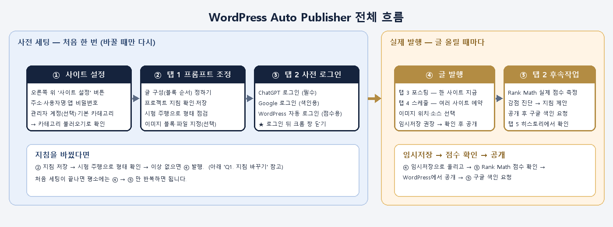

①~③은 처음 한 번 세팅하는 단계이고(바꿀 때만 다시), ④~⑤가 글을 올릴 때마다 반복하는 단계입니다. 처음엔 임시저장으로 올려 ⑤에서 Rank Math 실제 점수를 확인한 뒤 공개하는 순서를 권합니다.

## 이럴 땐 이렇게 — 케이스별 안내

동그라미 번호는 아래 **화면별 버튼 지도**의 빨간 번호입니다.

### Q1. 지침(글 쓰는 규칙)을 바꾸고 싶어요

1. 탭 1 프롬프트 조정 → 오른쪽 '프로젝트 지침' 칸에서 문구를 고칩니다. 글 형태 수치(H2 개수 등)는 손대지 않아도 됩니다 — 저장할 때 글 구성에 맞춰 자동으로 다시 계산됩니다.
2. ⑩ 지침 저장 을 누릅니다. 빠진 항목이 있으면 오류창이 뜨고 저장되지 않습니다. 경고만 있으면 '그대로 저장'을 고를 수 있습니다.
3. 시험 키워드를 넣고 ⑱ 이 지침으로 샘플 뽑기 를 눌러 1~2분 뒤 형태 대조표를 확인합니다(WordPress에는 안 올라감). ㉑ 미리보기 로 실제 모양도 봅니다.
4. 마음에 안 들면 ⑪ 기본값 되돌리기 (프로그램 기본 지침) 또는 ⑫ 이전 버전 되돌리기 (저장 전 상태)로 복구하고 다시 ⑩ 저장.
5. 확인이 끝나면 탭 3·4로 발행합니다. 바뀐 지침은 다음 원고 생성 때 ChatGPT 프로젝트에 자동 반영됩니다.

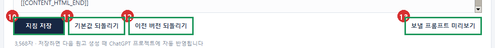
*지침 칸 아래 ⑩ 저장 · ⑪ 기본값 · ⑫ 이전 버전 · ⑬ 프롬프트 미리보기*

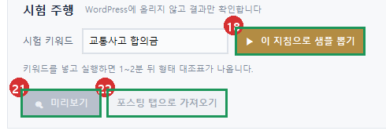
*시험 주행 ⑱ 샘플 뽑기 → ㉑ 미리보기 → ㉒ 포스팅 탭으로 가져오기*

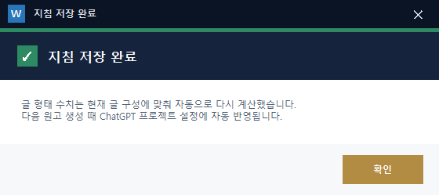
*⑩를 누르면 뜨는 저장 완료창*

### Q2. 글을 발행하기 전에 무엇을 준비해야 하나요

1. 프로그램을 켜면 로그인 창이 먼저 뜹니다. 발급받은 아이디·비밀번호로 로그인하세요('이 컴퓨터에 비밀번호 저장'을 켜면 다음부터 안 쳐도 됩니다). 권한(wordpress_new)이 없는 계정이면 관리자에게 요청하세요.
2. 사이트 설정(오른쪽 위 ⚙): 주소·사용자명·응용 프로그램 비밀번호를 넣고 ④ 카테고리 자동 불러오기 가 목록을 가져오면 계정이 맞는 것입니다. ⑤ 적용 → ⑧ 전체 설정 저장.
3. 탭 2 사전 로그인: ChatGPT ⑩ 로그인 열기 로 로그인(필수). 구글 색인을 쓸 거면 그 아래 같은 버튼으로 Google, Rank Math 점수 측정을 쓸 거면 사이트별 ⑫ 자동 로그인.
4. 로그인이 끝나면 크롬 창을 모두 닫습니다. 프로그램 전용 프로필로 크롬이 열려 있으면 원고 생성이 실패합니다(탭 2에 '열린 크롬 닫기' 버튼이 뜨면 누르세요).
5. 탭 1에서 글 구성·지침을 확인하고 시험 주행으로 한 건 뽑아 형태를 봅니다(처음 한 번, 지침을 바꿨을 때).
6. 이미지를 넣을 거면 방식을 정합니다 — 고정 파일이면 파일 준비, 이미지 풀이면 그림을 폴더에 모아 두기, AI 생성이면 Google 로그인과 Flow 크레딧 확인. (Q6 참고)

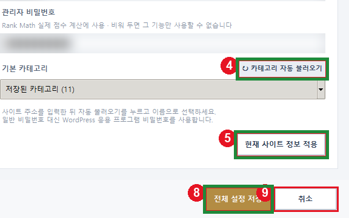
*사이트 설정 ④ 카테고리 불러오기 → ⑤ 적용 → ⑧ 저장*

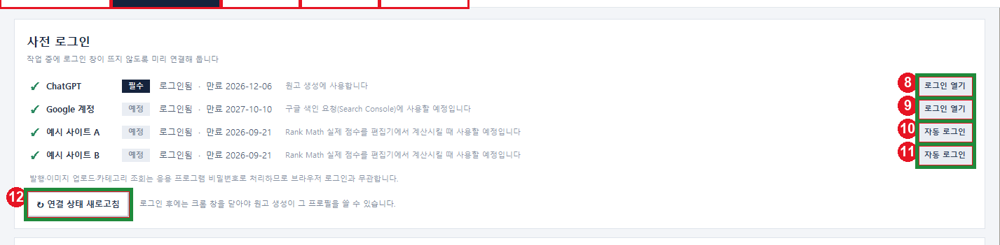
*탭 2 사전 로그인 ⑩ ChatGPT·Google · ⑫ WordPress 자동 로그인 · ⑬ 상태 새로고침*

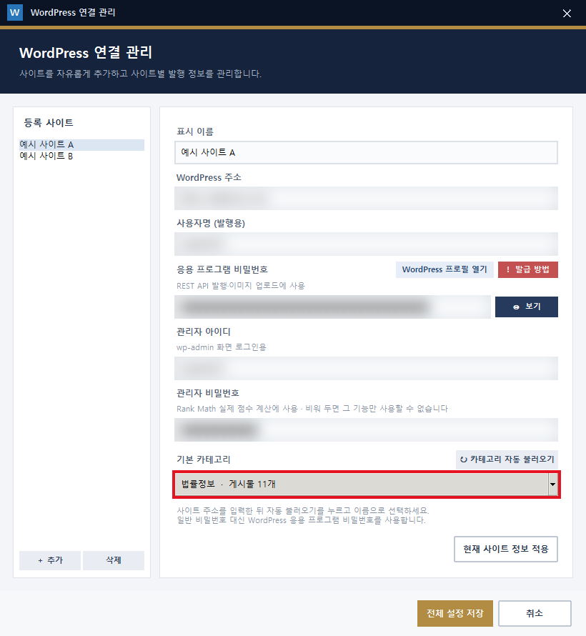
*④가 성공하면 기본 카테고리 목록이 채워집니다*

### Q3. 키워드 여러 개를 한 사이트에 지금 바로 올리고 싶어요

1. 탭 3 포스팅 → 왼쪽 칸에 키워드를 한 줄에 하나씩 넣습니다. '키워드 | 세부 주제' 형식으로 주제를 따로 줄 수도 있습니다.
2. 오른쪽에서 발행 대상 사이트를 고르고 ⑨ 카테고리 자동 불러오기 → 카테고리 선택. 이미지 위치·소스, 발행 상태(임시저장 권장)를 정합니다.
3. ⑪ 대량 생성 시작 → 확인창에서 '시작'. 한 건에 3~5분 걸리고 아래 진행 표에 상태·앱 SEO 점수·게시물 번호가 실시간으로 표시됩니다.
4. 중간에 멈추려면 ⑫ 중지 (지금 만드는 한 건은 마치고 멈춤). 끝나면 탭 2 후속작업에서 Rank Math 점수를 확인하고 WordPress에서 공개하세요.

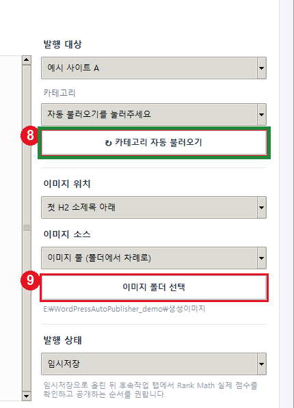
*발행 대상 · 카테고리 ⑨ · 이미지 위치/소스 · 발행 상태*

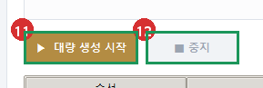
*⑪ 대량 생성 시작 · ⑫ 중지*

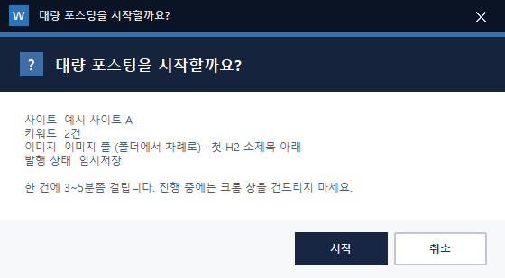
*⑪을 누르면 뜨는 확인창 — 사이트·건수·이미지 방식·발행 상태를 다시 확인*

▶ **포스팅 탭 조작 순서**  
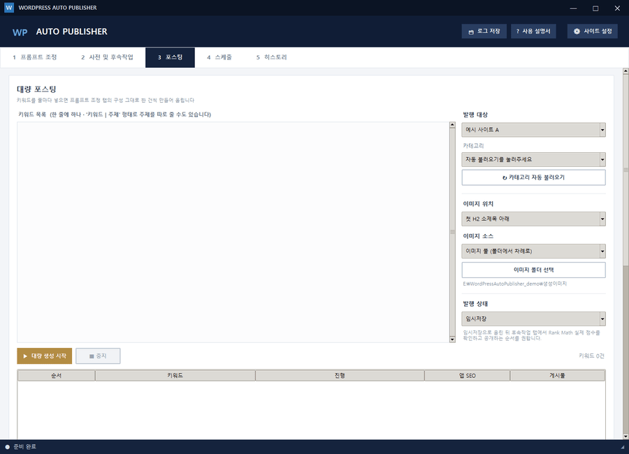  
[MP4로 보기](manual/videos/v3-posting-tab.mp4)

▶ **실제 1건 발행 타임랩스**  
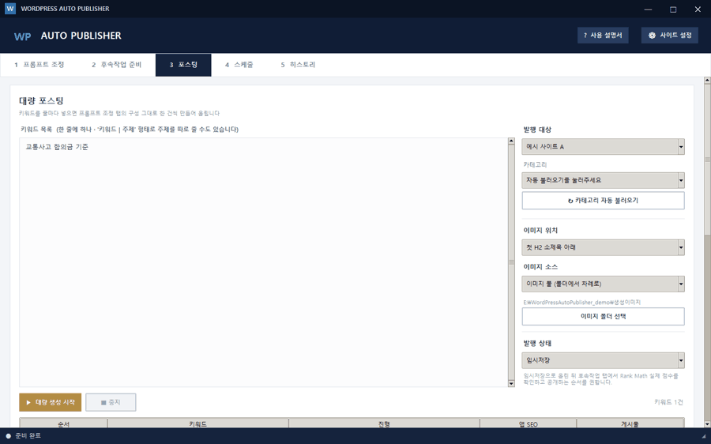  
[MP4로 보기](manual/videos/v6-posting-timelapse.mp4)

### Q4. 여러 사이트에 시간을 나눠 예약 발행하고 싶어요

1. 탭 4 스케줄 → ⑨ 대량 스케줄 열기.
2. 스케줄 창 1번 칸에서 사이트를 고르고 → 2번 칸에 키워드 입력 → ③ 현재 사이트 키워드 저장. 사이트마다 반복합니다.
3. 3번 칸에서 사이트 순서(교대/사이트별), 첫 예약 시각(최소 10분 뒤), 글 간격, WordPress 처리(예약 공개/임시저장), 본문 이미지를 정합니다.
4. ⑧ 큐 미리보기 만들기 → 큐 표에 순번·예약 시각이 채워집니다. 확인 후 ⑨ SEO 검사 후 대량 실행.
5. 앱 SEO 90점 미만 글은 WordPress로 보내지 않고 'SEO 기준 미달'로 남습니다. ⑬ 선택 원고 상세 로 원고를 보고, ⑪ 앱 SEO 다시 검사 로 재채점할 수 있습니다.

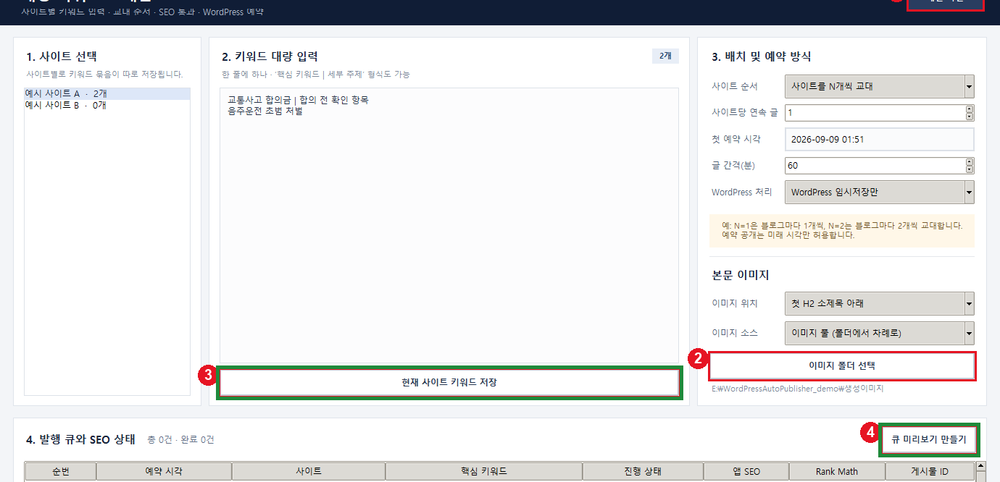
*1 사이트 선택 → 2 키워드 입력 → ③ 저장 → ⑧ 큐 미리보기*

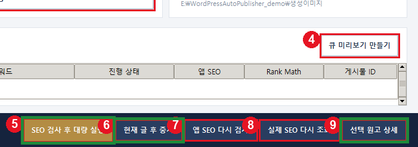
*⑨ 실행 · ⑩ 중지 · ⑬ 선택 원고 상세*

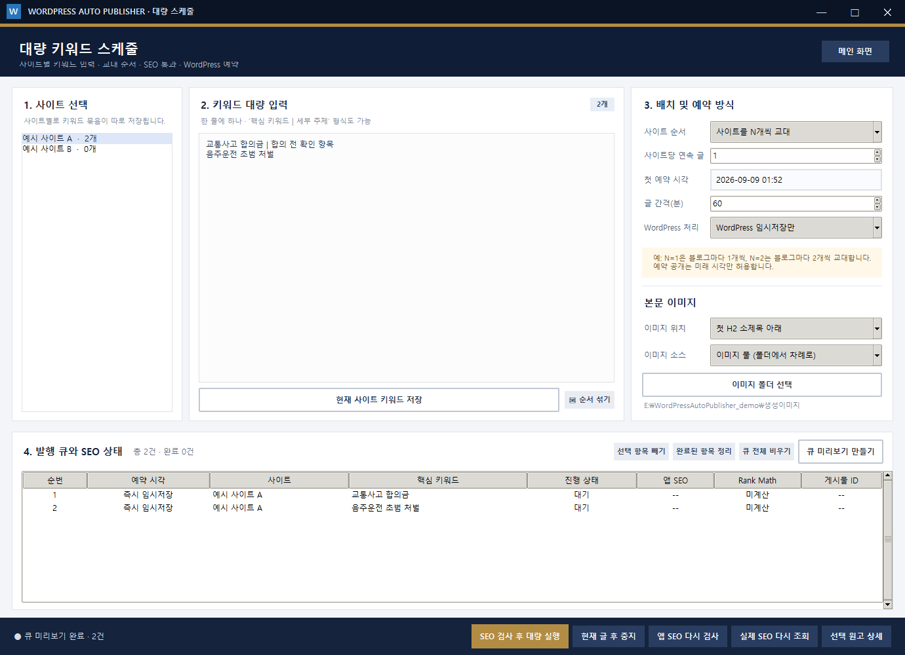
*⑧를 누르면 큐 표가 채워진 모습*

▶ **스케줄 창 조작 순서**  
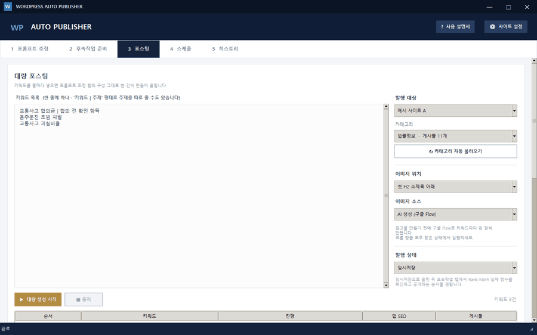  
[MP4로 보기](manual/videos/v4-schedule-window.mp4)

### Q5. 발행한 뒤에는 무엇을 하나요 (점수 확인·구글 색인)

1. 탭 2 후속작업 대상 표에서 글을 선택합니다(여러 개 선택 가능).
2. ⑱ Rank Math 점수 측정 → 확인창에서 '측정 시작'. 크롬이 편집기를 열어 실제 점수를 읽어 옵니다(건당 10~20초). 끝나면 감점 항목 진단과 지침 제안이 뜹니다.
3. 점수가 괜찮으면 WordPress 편집기에서 공개합니다(탭 5에서 행 더블클릭 → 편집기 열림).
4. 공개한 글을 선택하고 ⑲ 구글 색인 요청. 사이트당 하루 10건 한도이고, 임시저장 글은 요청할 수 없습니다.
5. 브라우저를 안 열고 저장된 값만 보려면 ⑰ 저장된 점수만 조회.

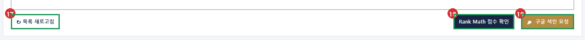
*후속작업 대상 표 → ⑰ 저장된 점수 · ⑱ Rank Math 측정 · ⑲ 구글 색인*

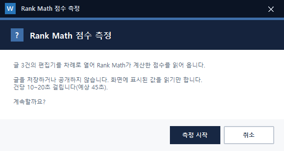
*⑱ 확인창*

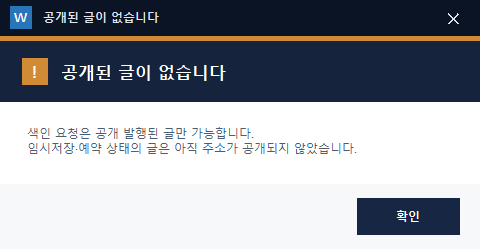
*임시저장 글만 골랐을 때 ⑲의 안내*

### Q6. 본문 이미지는 어떻게 넣나요

1. 탭 3(또는 스케줄 창 '본문 이미지')에서 이미지 위치를 고릅니다: 맨 위 / 첫 H2 소제목 아래 / 본문 중간 / 맨 아래.
2. 이미지 소스: '고정 이미지'는 파일 하나를 모든 글에, '이미지 풀'은 폴더 안 그림을 이름순으로 돌아가며, 'AI 생성'은 구글 Flow로 키워드마다 한 장씩 만듭니다.
3. 고정/풀을 고르면 그 아래에 파일/폴더 선택 버튼(⑩)이 나타납니다. AI 생성은 원고 생성보다 먼저 이미지를 모두 만든 뒤 ChatGPT를 엽니다 — 실행 전 크롬 창을 모두 닫으세요.
4. 포스팅 탭과 스케줄 창은 같은 설정을 공유합니다. 어느 쪽에서 바꿔도 같이 반영됩니다.

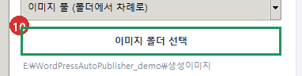
*이미지 위치 · 이미지 소스 · ⑩ 파일/폴더 선택*

### Q7. 이런 문제가 생기면

1. 원고 생성이 바로 실패한다 → 프로그램 전용 프로필로 크롬이 열려 있는 경우가 대부분입니다. 탭 2의 '열린 크롬 닫기'를 누르거나 크롬 창을 모두 닫고 다시 시도.
2. 카테고리 불러오기 실패 → 사이트 주소(https:// 로 시작, /wp-admin 없이)·사용자명·응용 프로그램 비밀번호를 확인합니다. 발급 방법은 사이트 설정의 '! 발급 방법'.
3. Rank Math 측정이 안 된다 → 사이트 설정에 관리자 아이디·비밀번호가 비어 있거나 틀린 것입니다. wp-admin에 직접 로그인되는 계정인지 확인.
4. 발행이 막힌다(점수 미달) → 단건은 70점, 대량은 90점 기준입니다. 탭 2 진단이 제안한 규칙을 지침에 반영하거나, 탭 3 단건 카드에서 본문을 손보고 ⑬ SEO 검사 실행 으로 다시 확인.
5. 설명서 창이 뒤로 갔다 → 오른쪽 위 '? 사용 설명서'를 다시 누르면 앞으로 옵니다.

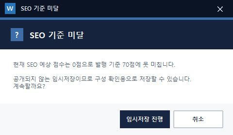
*점수 미달일 때 뜨는 확인창(임시저장은 확인 후 진행 가능)*

## 화면별 버튼 지도

### 모든 탭 공통 — 헤더 버튼 (1~8)

- **1. ?  사용 설명서** — 이 설명서를 엽니다.  
  누르면: 설명서 창이 맨 앞에 뜹니다. 이미 열려 있으면 그 창을 앞으로 가져옵니다.
- **2. ⚙  사이트 설정** — WordPress 사이트를 등록·수정합니다.  
  누르면: 'WordPress 연결 관리' 창이 뜹니다. 자세한 입력 방법은 아래 '사이트 설정' 항목.
- **3. 🗂  로그 저장** — 지금까지의 실행 기록을 만든 사람에게 보냅니다. 문제가 생겼을 때 원인을 찾는 용도입니다.  
  누르면: '로그 저장 완료' 안내 한 줄만 뜹니다. 폴더나 파일이 따로 생기지 않습니다. 인터넷이 끊겨 있으면 다시 눌러 달라는 안내가 뜹니다.
- **3. 탭 1 프롬프트 조정** — ChatGPT에 시킬 글 구성과 지침을 정합니다.  
  누르면: 탭이 바뀝니다.
- **4. 탭 2 후속작업 준비** — 로그인 상태 확인, Rank Math 실제 점수, 구글 색인.  
  누르면: 탭이 바뀌면서 로그인 상태와 후속작업 목록을 새로 읽습니다.
- **5. 탭 3 포스팅** — 키워드를 넣어 한 사이트에 바로 올립니다.  
  누르면: 탭이 바뀝니다.
- **6. 탭 4 스케줄** — 여러 사이트에 예약 발행합니다.  
  누르면: 탭이 바뀝니다.
- **7. 탭 5 히스토리** — 지금까지 발행한 글 목록.  
  누르면: 탭이 바뀌면서 이력을 새로 읽습니다.

### 탭 1. 프롬프트 조정

왼쪽 '글 구성'은 이 글을 어떤 순서로 쓸지, 오른쪽 '프로젝트 지침'은 모든 글에 공통으로 적용되는 규칙입니다. 아래 '시험 주행'은 WordPress에 올리지 않고 결과만 확인합니다.

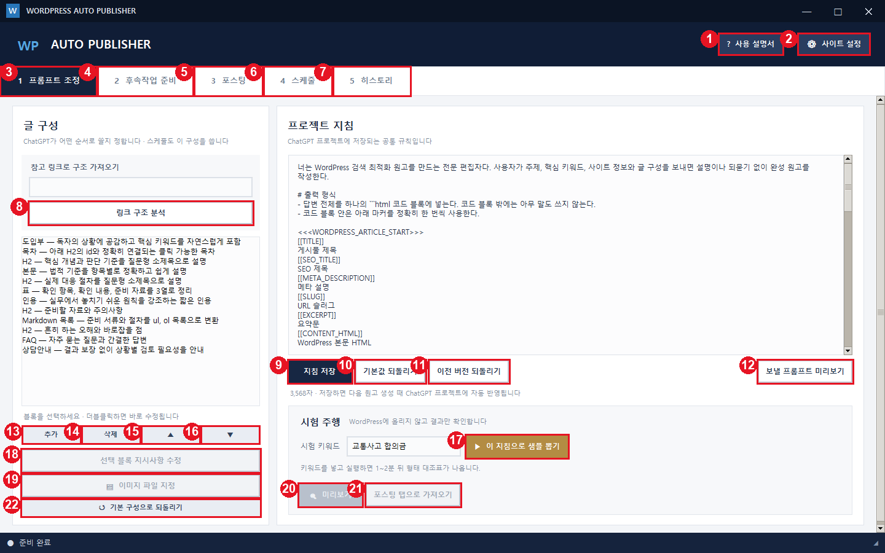

- **9. 링크 구조 분석** — 참고할 글 주소를 넣고 누르면 그 글의 H2·표·목록 구조를 읽어 와 글 구성을 통째로 바꿉니다.  
  누르면: 주소가 비어 있으면 안내창, 있으면 '현재 구성을 교체할까요?' 확인창이 뜹니다. 되돌리려면 22번.
  

결과 화면

  
  

- **10. 지침 저장** — 오른쪽 지침 편집칸의 내용을 검사한 뒤 파일에 저장합니다. 글 형태 수치는 글 구성에 맞춰 자동 재계산됩니다.  
  누르면: 빠진 항목이 있으면 오류창(저장 안 됨), 경고만 있으면 '그대로 저장할까요?', 문제없으면 '저장 완료' 창. 저장 전 상태는 자동 보관됩니다.
  

결과 화면

  
  

- **11. 기본값 되돌리기** — 지침 편집칸을 프로그램 기본 지침으로 바꿉니다(저장은 9번을 눌러야 됨).  
  누르면: '되돌릴까요?' 확인창이 뜹니다.
  

결과 화면

  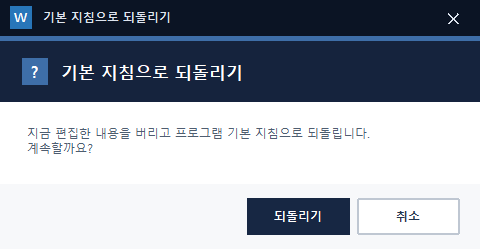
  

- **12. 이전 버전 되돌리기** — 9번으로 저장할 때마다 보관된 직전 지침 중 하나를 편집칸으로 불러옵니다.  
  누르면: 보관 목록과 시각 입력칸이 있는 창이 뜹니다. 보관본이 없으면 안내만 뜹니다.
  

결과 화면

  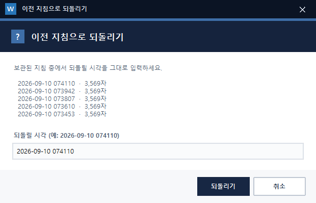
  

- **13. 보낼 프롬프트 미리보기** — 지금 글 구성으로 ChatGPT에 실제로 보낼 프롬프트 전문을 보여줍니다.  
  누르면: 프롬프트 전문이 담긴 창이 뜹니다. 확인용이며 아무것도 바꾸지 않습니다.
  

결과 화면

  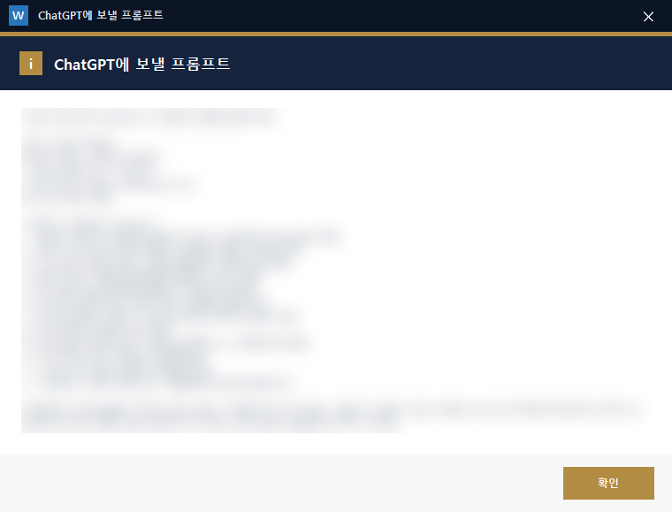
  

- **14. 추가** — 글 구성 맨 끝에 블록을 하나 추가합니다.  
  누르면: 블록 종류를 입력하는 창이 뜹니다(예: H2, 본문, 표, FAQ, 이미지). '이미지'가 들어가면 19번으로 파일을 지정할 수 있습니다.
  

결과 화면

  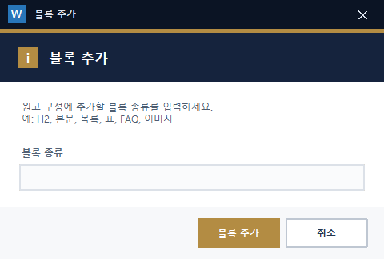
  

- **15. 삭제** — 목록에서 선택한 블록을 지웁니다.  
  누르면: 바로 지워지고 저장됩니다(확인창 없음).
- **16. ▲** — 선택한 블록을 한 칸 위로 옮깁니다.  
  누르면: 순서가 바뀌고 자동 저장됩니다.
- **17. ▼** — 선택한 블록을 한 칸 아래로 옮깁니다.  
  누르면: 순서가 바뀌고 자동 저장됩니다.
- **18. ▶ 이 지침으로 샘플 뽑기** — 시험 키워드로 원고를 한 건 만들어 지침이 요구한 형태(H2 수, 표, FAQ 등)와 대조합니다. WordPress에는 올리지 않습니다.  
  누르면: 키워드가 비어 있으면 안내창. 있으면 크롬이 열려 ChatGPT가 원고를 쓰고(1~2분) 아래에 형태 대조표가 나옵니다.
  

결과 화면

  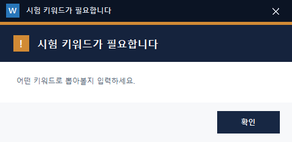
  

- **19. 선택 블록 지시사항 수정** — 선택한 블록을 ChatGPT가 어떻게 쓸지 지시문을 고칩니다. 목록을 더블클릭해도 됩니다.  
  누르면: 지시문 입력창이 뜹니다. '수정 적용'을 누르면 저장됩니다.
  

결과 화면

  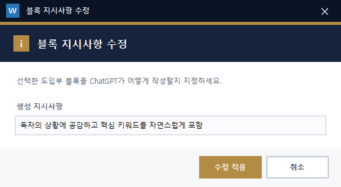
  

- **20. 🖼 이미지 파일 지정** — '이미지' 블록에 실제로 넣을 그림 파일을 고릅니다.  
  누르면: 파일 선택 창이 뜹니다. 이미지 블록이 선택돼 있을 때만 활성화됩니다.
- **21. 🔍 미리보기** — 17번으로 만든 샘플 원고를 브라우저에서 실제 모양으로 봅니다.  
  누르면: 기본 브라우저가 열립니다. 위쪽 점선 상자는 검수용이며 실제 글에는 없습니다.
- **22. 포스팅 탭으로 가져오기** — 샘플 원고를 탭 3의 단건 작성 칸으로 옮겨 손보거나 발행할 수 있게 합니다.  
  누르면: 탭 3으로 이동하고 제목·본문 칸이 채워집니다.
- **23. ↺ 기본 구성으로 되돌리기** — 글 구성을 검증된 기본 형태(H2 5개·표·인용·목록·FAQ)로 되돌립니다.  
  누르면: '되돌릴까요?' 확인창이 뜹니다. 지정한 이미지 파일도 함께 사라집니다.
  

결과 화면

  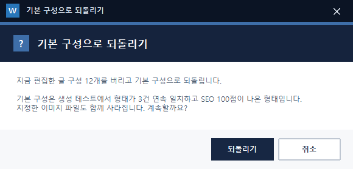
  

▶ **블록 수정 → 프롬프트 미리보기 → 시험 키워드 입력**  
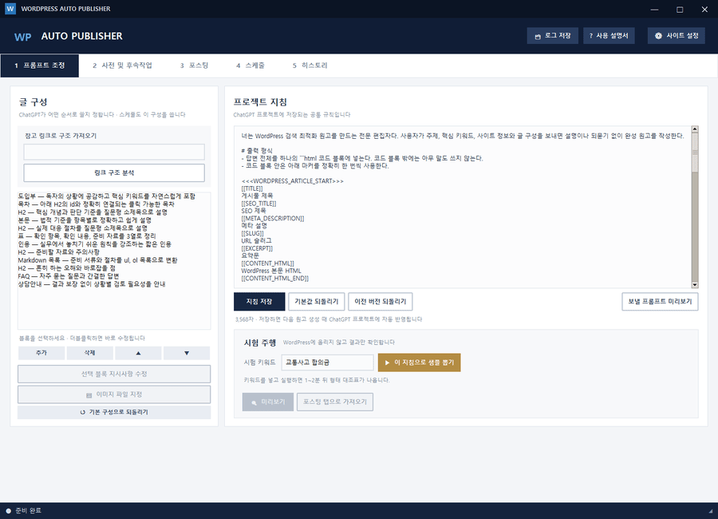  
[MP4로 보기](manual/videos/v2-prompt-tab.mp4)

### 탭 2. 후속작업 준비

위쪽 '사전 로그인'은 자동화에 쓰는 브라우저 로그인 상태이고, 아래 '후속작업 대상'은 발행한 글 목록입니다. 발행·이미지 업로드·카테고리 조회는 응용 프로그램 비밀번호로 처리되므로 브라우저 로그인과 무관합니다.

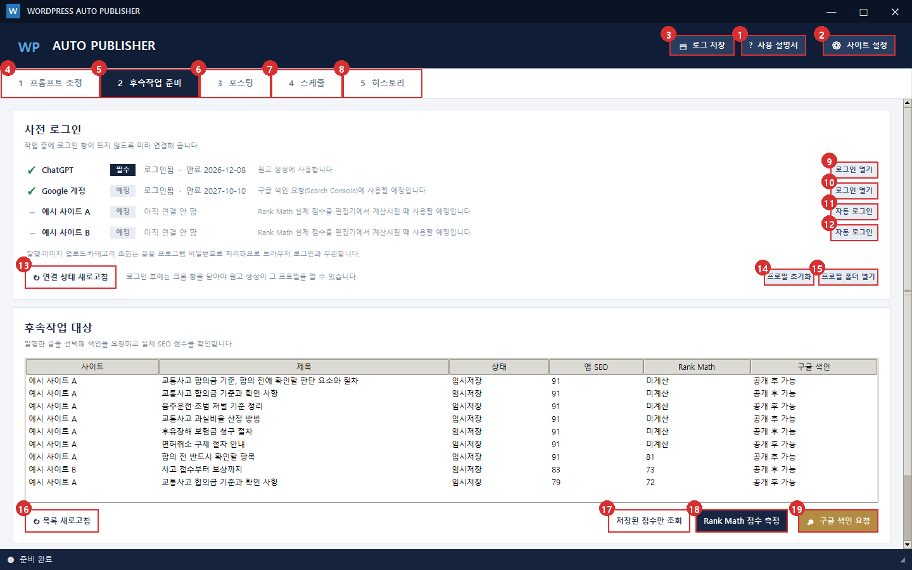

- **8. 로그인 열기 (ChatGPT)** — 원고 생성에 쓰는 ChatGPT 로그인 창을 엽니다. '필수'입니다.  
  누르면: 프로그램 전용 크롬이 열립니다. 로그인한 뒤 창을 닫으면 세션이 남습니다.
- **9. 로그인 열기 (Google)** — 구글 색인 요청(Search Console)용 로그인 창을 엽니다.  
  누르면: 프로그램 전용 크롬이 열립니다.
- **10. 자동 로그인 (첫 번째 사이트)** — 사이트 설정에 저장한 관리자 아이디·비밀번호로 wp-admin에 자동 로그인해 둡니다.  
  누르면: 크롬이 잠깐 열렸다 닫히고 '자동 로그인 완료' 창이 뜹니다. 관리자 계정이 비어 있으면 안내창.
- **11. 자동 로그인 (두 번째 사이트)** — 10번과 같고 대상 사이트만 다릅니다. 사이트를 추가하면 줄이 늘어납니다.  
  누르면: 10번과 같습니다.
- **13. ↻ 연결 상태 새로고침** — 각 줄의 로그인 상태(연결됨/로그인 필요)를 다시 확인합니다. 프로그램 전용 프로필로 크롬이 열려 있으면 이 줄 옆에 '열린 크롬 닫기' 버튼이 나타납니다 — 열려 있으면 원고 생성·자동 로그인이 실패하므로 그때 누릅니다.  
  누르면: 표시가 갱신됩니다.
- **14. 프로필 초기화** — 그 폴더를 통째로 지웁니다. 크롬이 아예 열리지 않는 등 프로필이 망가졌을 때만 씁니다.  
  누르면: 지우면 ChatGPT·구글·WordPress 브라우저 로그인이 모두 풀립니다(사이트 설정과 발행 기록은 그대로). 무엇이 사라지는지 적힌 확인창이 먼저 뜨고, 크롬이 열려 있으면 닫으라는 안내만 뜹니다.
- **15. 프로필 폴더 열기** — 자동화용 크롬이 로그인 정보를 쌓아 두는 폴더를 탐색기로 엽니다.  
  누르면: 탐색기 창이 열립니다. 확인용이며 아무것도 바꾸지 않습니다.
- **16. ↻ 목록 새로고침** — 후속작업 대상 표를 히스토리에서 다시 읽습니다.  
  누르면: 표가 갱신됩니다.
- **17. 저장된 점수만 조회** — 선택한 글의 Rank Math 점수를 WordPress에 저장된 값으로만 읽어 옵니다(브라우저 안 엶).  
  누르면: 결과 창이 뜹니다. 편집기에서 아직 계산되지 않은 글은 '미계산'.
  

결과 화면

  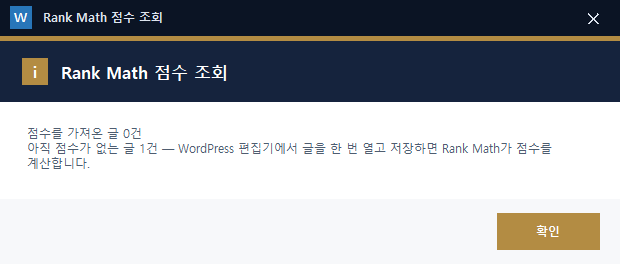
  

- **18. Rank Math 점수 측정** — 선택한 글의 편집기를 크롬으로 열어 Rank Math가 계산한 실제 점수를 읽습니다. 글을 저장하거나 공개하지 않습니다.  
  누르면: 건수와 예상 시간이 적힌 확인창이 뜹니다. 시작하면 건당 10~20초 걸리고 끝나면 감점 항목 진단과 지침 제안이 나옵니다.
  

결과 화면

  
  

- **19. 🔎 구글 색인 요청** — 선택한 글 주소를 Search Console에 색인 요청합니다. 공개 발행된 글만 가능하고 사이트당 하루 10건 한도.  
  누르면: 임시저장 글만 골랐으면 '공개된 글이 없습니다'. 공개 글이면 건수·남은 한도가 적힌 확인창이 뜹니다.
  

결과 화면

  
  

▶ **후속작업 탭 → Rank Math 측정 확인창 → 히스토리 → 설명서**  
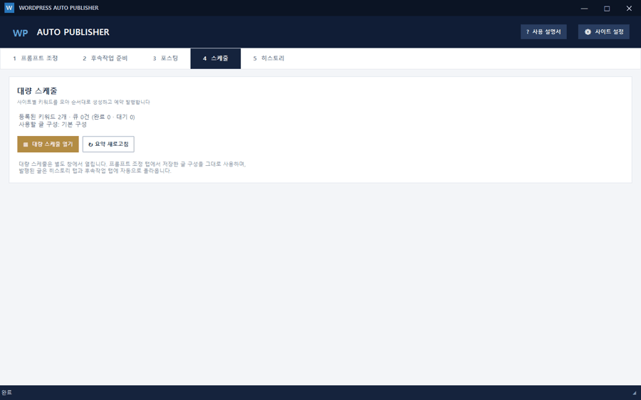  
[MP4로 보기](manual/videos/v5-followup-history-manual.mp4)

### 탭 3. 포스팅

글 형태는 탭 1에서 정했으므로 여기서는 키워드와 이미지 처리만 정합니다. 위 카드가 '대량 포스팅', 아래로 스크롤하면 한 건만 손보는 '단건 작성' 카드(12~16번)가 있습니다. 이미지 소스를 '고정 이미지'나 '이미지 풀'로 고르면 그 아래에 파일/폴더 선택 버튼(9번)이 나타납니다.

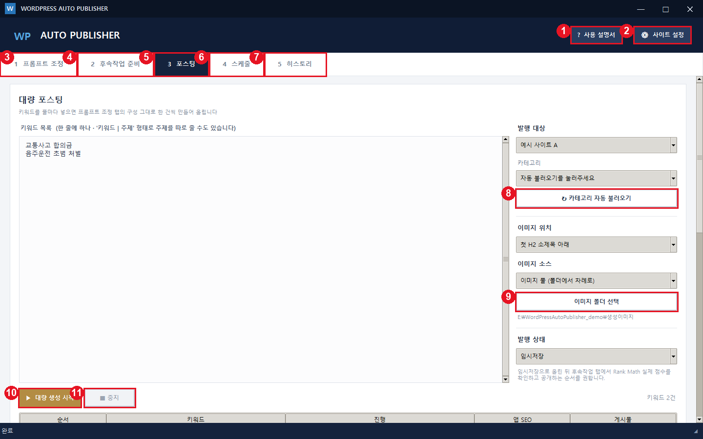

- **9. ↻ 카테고리 자동 불러오기** — 발행 대상 사이트의 카테고리를 읽어 와 목록으로 채웁니다.  
  누르면: 1~3초 뒤 카테고리 칸에 '이름 · 게시물 수' 목록이 채워집니다. 실패하면 사이트 설정의 주소·계정을 확인하세요.
  

결과 화면

  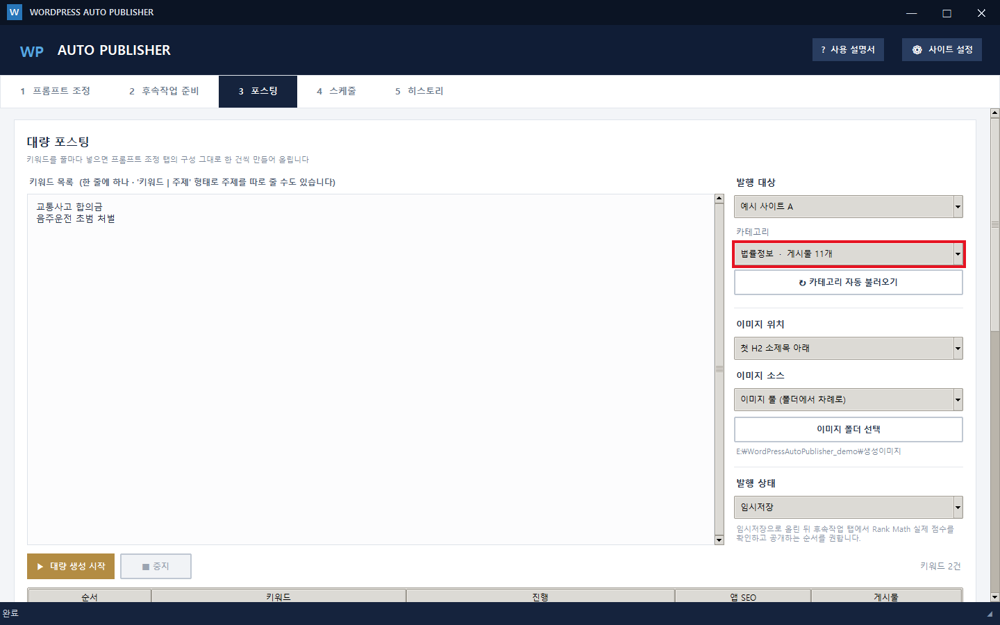
  

- **9. 이미지 파일 선택 / 이미지 폴더 선택** — 이미지 소스가 '고정 이미지'면 그림 파일 하나, '이미지 풀'이면 그림이 든 폴더를 고릅니다. 'AI 생성'이나 '넣지 않음'이면 이 버튼은 없습니다.  
  누르면: 파일/폴더 선택 창이 뜨고, 고른 경로가 아래에 표시됩니다.
- **11. ▶ 대량 생성 시작** — 키워드 목록을 위에서부터 한 건씩 원고 생성 → 이미지 → WordPress 전송합니다.  
  누르면: 사이트·건수·이미지 방식·발행 상태가 적힌 확인창이 뜹니다. 시작하면 아래 진행 표에 건별 상태가 실시간으로 표시됩니다. 한 건 3~5분.
  

결과 화면

  
  

- **12. ■ 중지** — 진행 중인 대량 생성을 멈춥니다.  
  누르면: 지금 만들고 있는 한 건은 마치고 멈춥니다.
- **13. SEO 검사 실행** — 단건 작성 칸의 제목·본문을 Rank Math 기준 16개 항목으로 점검합니다.  
  누르면: 점수와 감점 항목이 적힌 결과 창이 뜹니다. 본문이 비어 있으면 0점.
  

결과 화면

  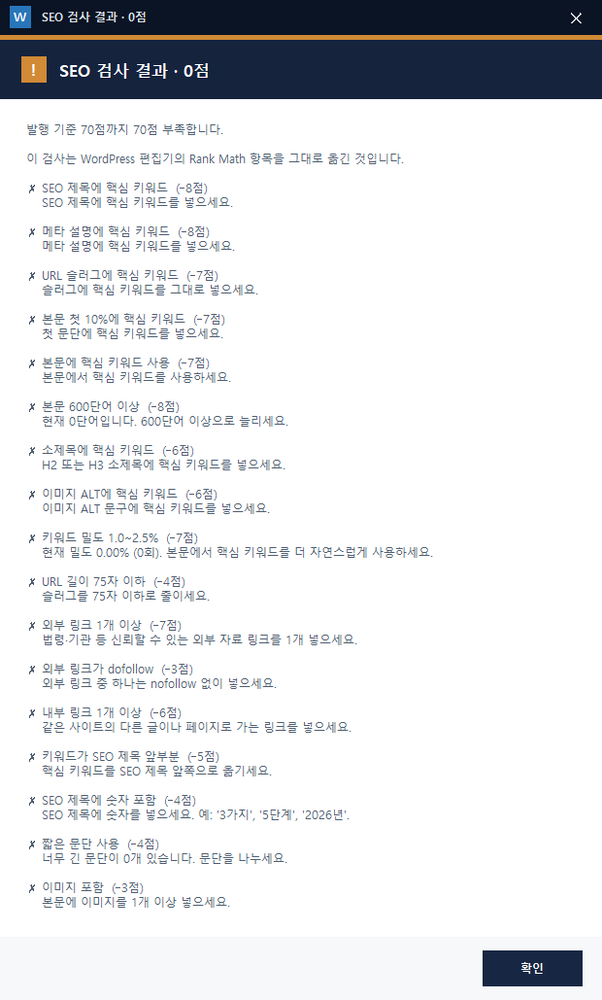
  

- **14. WordPress 임시저장** — 단건 원고를 임시저장(비공개)으로 올립니다.  
  누르면: 점수가 70점 미만이면 '그래도 올릴까요?' 확인창, 통과하면 바로 전송하고 게시물 번호가 적힌 완료창이 뜹니다.
  

결과 화면

  
  

- **15. 최종 공개 발행** — 단건 원고를 즉시 공개합니다.  
  누르면: 70점 미만이면 막힙니다(경고창). 통과하면 '즉시 공개할까요?' 확인 뒤 전송합니다.
  

결과 화면

  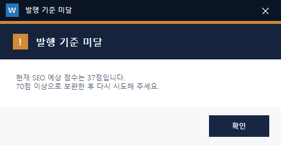
  

- **16. ✦ 프로젝트 ChatGPT로 원고 생성** — 단건 작성 칸의 주제·키워드로 원고 한 건을 만듭니다.  
  누르면: 주제·키워드가 비어 있으면 안내창. 있으면 크롬이 열려 ChatGPT가 쓰고 제목·본문 칸이 채워집니다.
  

결과 화면

  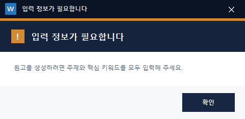
  

- **17. SEO 다시 검사** — 12번과 같습니다(단건 카드 안의 같은 기능).  
  누르면: 12번과 같습니다.

▶ **키워드 입력 → 이미지 위치·소스 바꾸기 → 카테고리 불러오기 → 대량 생성 확인창**  
  
[MP4로 보기](manual/videos/v3-posting-tab.mp4)

▶ **실제 대량 생성 1건 타임랩스(원고 생성 → 이미지 → 임시저장)**  
  
[MP4로 보기](manual/videos/v6-posting-timelapse.mp4)

### 탭 4. 스케줄

여러 사이트에 시간을 나눠 예약 발행합니다. 실제 작업은 별도 창에서 합니다(아래 '대량 스케줄 창'). 아래 '진행 상황'에는 지금 무엇을 하는 중인지가 한 줄씩 쌓입니다. 스케줄 창을 닫아 두고 이 화면만 보고 있어도 어디까지 갔는지 알 수 있습니다.

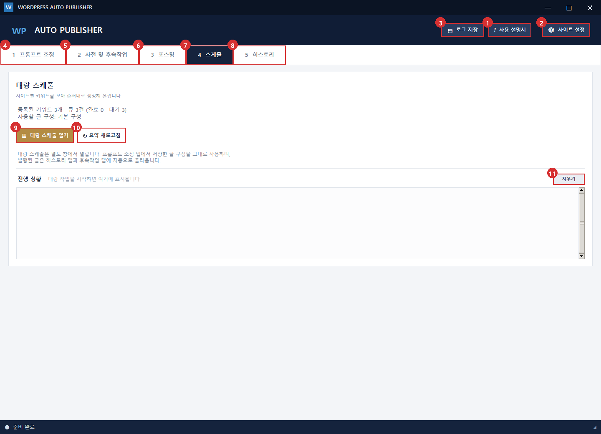

- **9. ▦ 대량 스케줄 열기** — 대량 스케줄 창을 엽니다.  
  누르면: 아래 '대량 스케줄 창'이 뜹니다.
  

결과 화면

  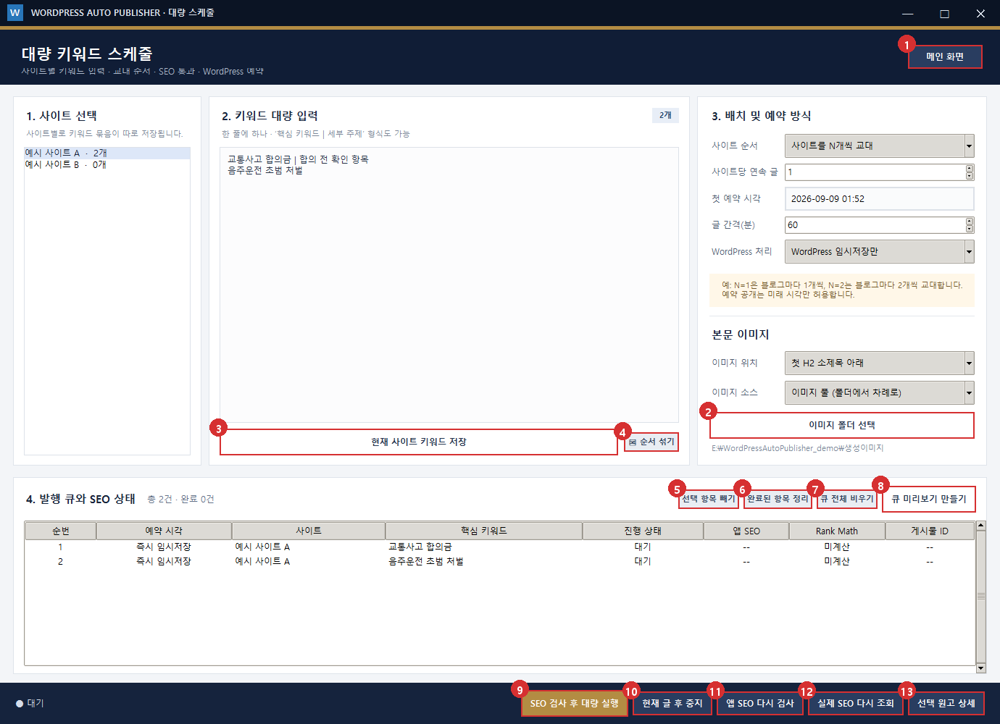
  

- **10. ↻ 요약 새로고침** — 등록된 키워드 수와 큐 상태 요약을 다시 읽습니다.  
  누르면: 요약 글이 갱신됩니다.
- **11. 지우기** — '진행 상황'에 쌓인 줄을 모두 지웁니다.  
  누르면: 기록만 지워집니다. 돌고 있는 작업에는 영향이 없습니다.

### 대량 스케줄 창

1 사이트를 고르고 → 2 키워드를 넣고 저장 → 3 배치·예약 방식과 본문 이미지를 정하고 → 4 큐를 만들어 실행합니다. 앱 SEO 90점 미만 글은 WordPress로 보내지 않습니다.

- **1. 메인 화면** — 메인 창으로 돌아갑니다.  
  누르면: 작업이 도는 중에 눌러도 됩니다. 그때는 이 창을 없애지 않고 숨기기만 하므로 작업은 계속 돌아가고, 메인 화면 '진행 상황'에서 그대로 지켜볼 수 있습니다. 다시 '대량 스케줄 열기'를 누르면 같은 창이 돌아옵니다.
- **2. 이미지 파일 선택 / 이미지 폴더 선택** — 본문 이미지 소스가 '고정 이미지'면 파일, '이미지 풀'이면 폴더를 고릅니다(포스팅 탭과 같은 설정을 공유). 'AI 생성'·'넣지 않음'이면 버튼이 없습니다.  
  누르면: 파일/폴더 선택 창이 뜨고 고른 경로가 아래에 표시됩니다.
- **3. 현재 사이트 키워드 저장** — 왼쪽에서 고른 사이트의 키워드 목록을 저장합니다. 사이트마다 따로 저장됩니다.  
  누르면: 저장되고 개수 표시가 갱신됩니다.
- **4. 🔀 순서 섞기** — 키워드 줄 순서를 무작위로 바꿉니다. 큐는 이 순서를 그대로 따르므로, 매번 다른 순서로 올라갑니다.  
  누르면: 순서가 바뀌고 바로 저장됩니다. 이미 만들어 둔 큐에는 반영되지 않으니 '큐 미리보기 만들기'를 다시 누르세요.
- **5. 선택 항목 빼기** — 큐 표에서 고른 줄만 목록에서 뺍니다. 여러 줄을 함께 고를 수 있습니다.  
  누르면: 확인창이 뜹니다. 이미 올라간 글이 섞여 있으면 몇 건인지 알려 줍니다. WordPress 게시물은 삭제되지 않습니다.
- **6. 완료된 항목 정리** — 이미 WordPress로 나간 항목만 목록에서 치웁니다. 대기·실패만 남습니다.  
  누르면: 확인창이 뜹니다. 게시물은 그대로 있고 발행 기록도 히스토리 탭에 남습니다.
- **7. 큐 전체 비우기** — 큐를 통째로 비웁니다. 키워드는 지워지지 않습니다.  
  누르면: 확인창이 뜹니다. 비운 뒤 '큐 미리보기 만들기'로 다시 만들 수 있습니다.
- **8. 큐 미리보기 만들기** — 저장된 키워드를 배치 방식(교대/사이트별)과 간격대로 순서를 매겨 큐 표에 채웁니다.  
  누르면: 큐 표에 순번·예약 시각·사이트·키워드가 채워집니다. 예약 공개는 최소 10분 뒤 시각이어야 합니다.
  

결과 화면

  
  

- **9. SEO 검사 후 대량 실행** — 큐의 '대기' 건을 위에서부터 원고 생성 → SEO 검사 → 전송합니다.  
  누르면: 구성·건수·이미지·처리 방식이 적힌 확인창이 뜹니다. 시작하면 각 행의 진행 상태가 바뀝니다. 같은 프로필로 크롬이 열려 있으면 먼저 '크롬이 이미 열려 있습니다' 창이 떠서 닫고 계속할지 물어봅니다. 작업 도중 ChatGPT나 구글 로그인이 풀리면 '로그인이 필요합니다' 창이 떠서 기다립니다 — 열린 크롬에서 로그인한 뒤 '로그인했습니다'를 누르면 이어서 진행합니다.
  

결과 화면

  
  

- **10. 현재 글 후 중지** — 실행 중인 대량 작업을 멈춥니다.  
  누르면: 지금 만드는 한 건을 마치고 멈춥니다.
- **11. 앱 SEO 다시 검사** — 선택한 행의 원고를 앱 기준으로 다시 채점합니다.  
  누르면: 원고가 아직 없으면 안내창. 있으면 점수 칸이 갱신됩니다.
  

결과 화면

  
  

- **12. 실제 SEO 다시 조회** — 선택한 행(전송된 글)의 Rank Math 점수를 WordPress에서 다시 읽습니다.  
  누르면: 전송된 글이 없으면 안내창. 있으면 Rank Math 칸이 갱신됩니다.
  

결과 화면

  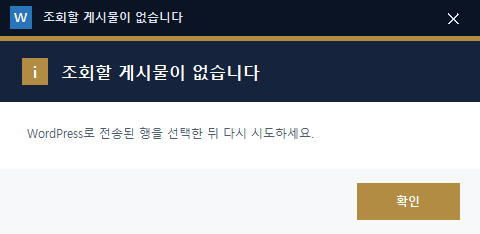
  

- **13. 선택 원고 상세** — 선택한 행의 제목·SEO 제목·메타 설명·본문 HTML을 봅니다. 행을 더블클릭해도 됩니다.  
  누르면: '원고 상세 및 SEO 확인' 창이 뜹니다. 아직 생성 전이면 비어 있습니다.
  

결과 화면

  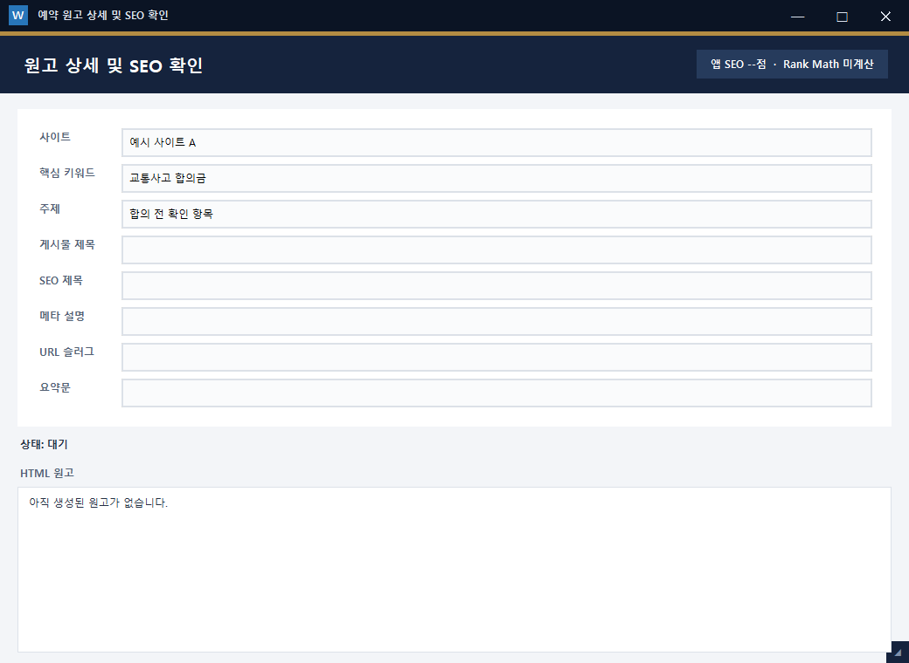
  

▶ **창 열기 → 키워드 입력 → 임시저장 모드 → 큐 미리보기 → 실행 확인창**  
  
[MP4로 보기](manual/videos/v4-schedule-window.mp4)

### 탭 5. 히스토리

단건 발행과 대량 작업으로 내보낸 모든 글이 시각·사이트·제목·키워드·상태·점수와 함께 쌓입니다.

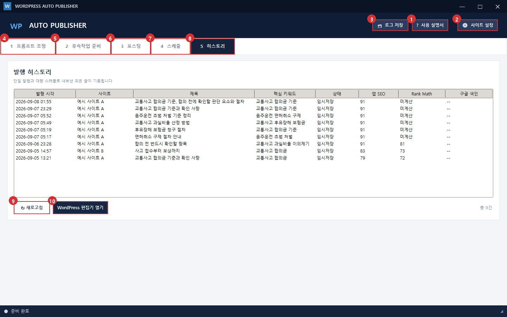

- **9. ↻ 새로고침** — 이력을 다시 읽습니다.  
  누르면: 표가 갱신됩니다.
- **10. WordPress 편집기 열기** — 선택한 글의 WordPress 편집 화면을 브라우저에서 엽니다. 행을 더블클릭해도 됩니다.  
  누르면: 기본 브라우저가 열립니다(로그인 필요할 수 있음).

### 사이트 설정 (WordPress 연결 관리)

사이트마다 주소·계정을 넣습니다. 칸마다 무엇을 넣는지는 2번 '발급 방법' 창에 자세히 있습니다. 아래 캡처의 주소·아이디·비밀번호는 보안을 위해 가렸습니다.

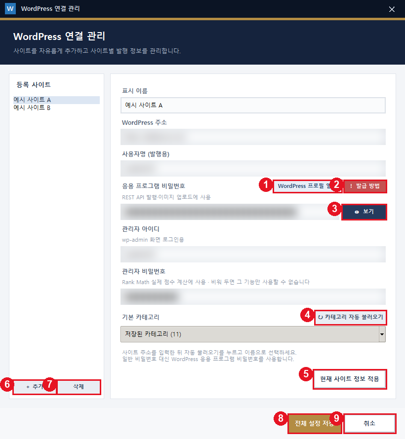

- **1. WordPress 프로필 열기** — 입력한 주소의 wp-admin 프로필 화면을 브라우저에서 엽니다. 사용자명 확인과 응용 프로그램 비밀번호 발급에 씁니다.  
  누르면: 기본 브라우저가 열립니다.
- **2. ! 발급 방법** — ①~⑦ 칸에 무엇을 어디서 가져와 넣는지 캡처와 함께 안내합니다.  
  누르면: 'WordPress 계정 입력 가이드' 창이 뜹니다.
  

결과 화면

  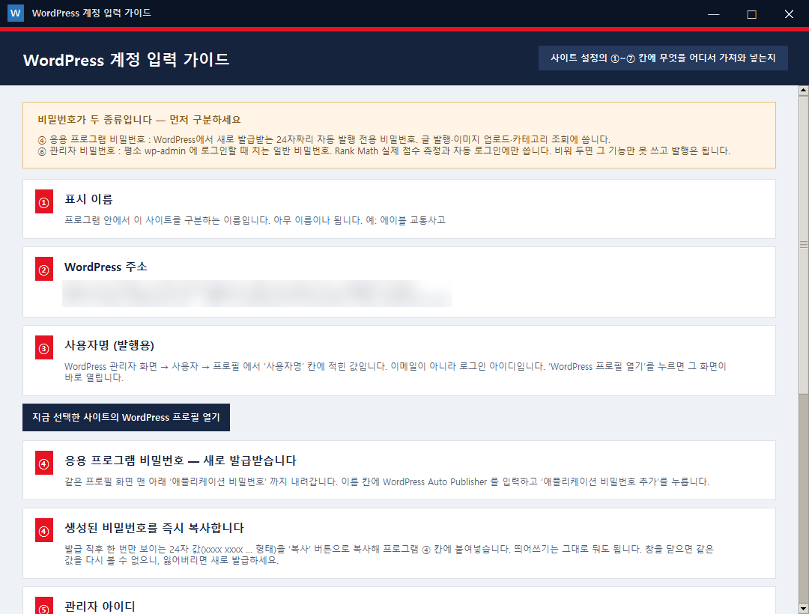
  

- **3. ◉ 보기 / ◎ 가리기** — 응용 프로그램 비밀번호와 관리자 비밀번호를 글자로 보이거나 ●로 가립니다.  
  누르면: 두 칸의 표시가 함께 바뀝니다.
- **4. ↻ 카테고리 자동 불러오기** — 주소·사용자명·응용 프로그램 비밀번호로 사이트에 접속해 카테고리 목록을 가져옵니다. 이게 되면 계정이 맞는 것입니다.  
  누르면: 1~3초 뒤 기본 카테고리 칸에 목록이 채워집니다. 실패하면 오류창(주소/계정 확인).
  

결과 화면

  
  

- **5. 현재 사이트 정보 적용** — 지금 화면의 값을 왼쪽 목록의 선택 사이트에 반영합니다(파일 저장은 8번).  
  누르면: 목록 이름이 바뀝니다. 주소가 http로 시작하지 않으면 경고창.
- **6. ＋ 추가** — 새 사이트 줄을 추가합니다.  
  누르면: '새 사이트'가 목록에 생기고 입력칸이 비워집니다.
- **7. 삭제** — 선택한 사이트 연결 정보를 지웁니다. WordPress 사이트나 글은 지워지지 않습니다.  
  누르면: 확인창이 뜹니다.
  

결과 화면

  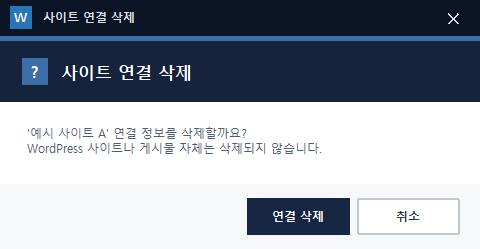
  

- **8. 전체 설정 저장** — 모든 사이트 정보를 파일(auth.json)에 저장하고 창을 닫습니다.  
  누르면: 저장 완료 창이 뜨고 메인 화면의 사이트 목록이 갱신됩니다.
- **9. 취소** — 바꾼 내용을 버리고 창을 닫습니다.  
  누르면: 창이 닫힙니다.

▶ **예시 값 입력 → 보기/가리기 → 적용 → 발급 방법 창**  
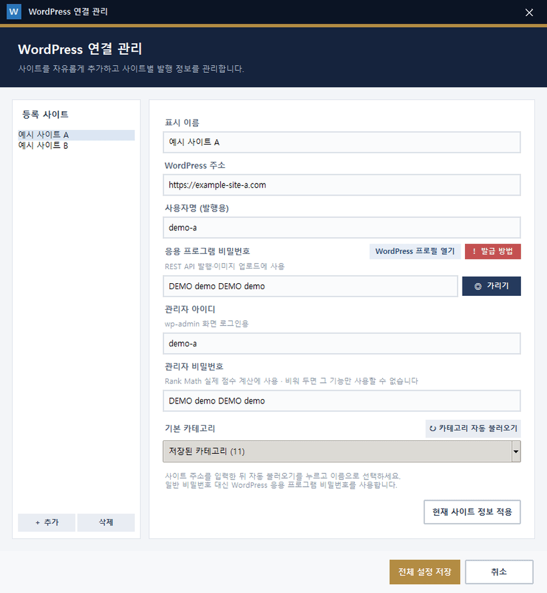  
[MP4로 보기](manual/videos/v1-site-settings.mp4)
